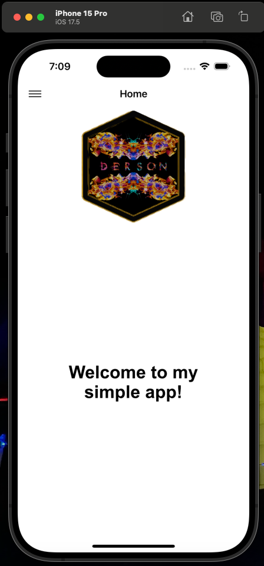

# iOS_SideMenu_Example
This is just a short example of a Swift Project creating a basic side menu iOS application.

No external libraries outside of what came with xCode were used.

I ran this application with the following, 

- [MacOS - Sonoma 14.6](https://developer.apple.com/documentation/macos-release-notes/macos-14_6-release-notes)
- [xCode - Version 15.4 (15F31d)](https://developer.apple.com/news/releases/?id=05132024a)
- Minimum Deployment set to iOS version 17.5

Once compiled, the application should present the Home View Controller as seen below with the hidden menu in the upper left of the screen.

Clicking the three lines in the upper left will cause the menu to slide in from the left. The menu will be populated with a few different options and selecting any of the options will cause the automation to present the given view through the UI.

Notes:

The `Share App` menu se 
